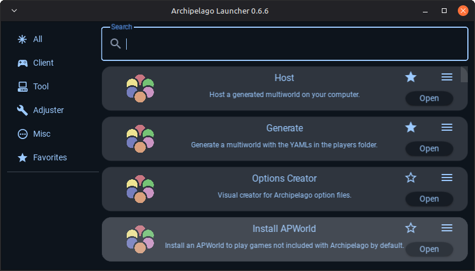
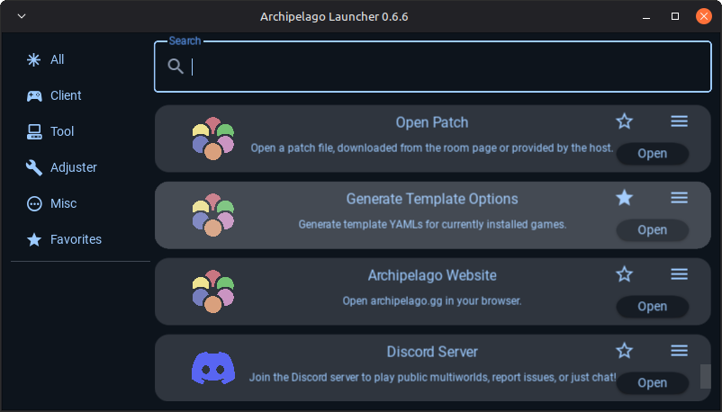
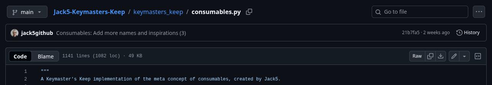

# Installation

This document teaches you how to install Keymaster's Keep (KMK) and its many game implementations.

It is assumed you have already installed the Archipelago Launcher. If not, follow the setup guides in the Archipelago section from [this linked webpage](https://archipelago.gg/tutorial/).

## Installing Keymaster's Keep

- **1\.** Download the `.apworld` of the [latest Keymaster's Keep release from *silasary*'s Archipelago fork on GitHub](https://github.com/silasary/Archipelago/releases?q=keymaster%27s+keep).

??? "Warning"
    If KMK changes maintainer from *silasary* in the future, the fork you will need to download the release from may change. To stay up to date, refer to the [Keymaster's Keep's thread](https://discord.com/channels/731205301247803413/1321323711676284939) on the [Archipelago Discord server](https://discord.gg/8Z65BR2).

- **2\.** Either place the `.apworld` file into the Archipelago Launcher's `worlds/` folder, or run the Archipelago Launcher and open **Install APWorld**, selecting the downloaded file.
    - If you do the latter, you must then close the Archipelago Launcher.

- **3\.** Run the Archipelago Launcher. KMK is installed successfully if a `keymasters_keep/` folder is automatically created.
- **4\.** In the Archipelago Launcher, open **Generate Template Options**. This will create the template player file `Players/Templates/Keymaster's Keep.yaml`, which contains the customisable settings for KMK.

KMK comes with the **[Custom (META)](../games/custom_game/)** and **[Game Backlog (META)](../games/game_backlog_game/)** implementations pre-installed, but isn't the same without additional game implementations tailored to you. Refer to the below section for more information.

## Installing KMK Game Implementations

- **1\.** Browse **this codex** for a game you wish to add to your KMK.
- **2\.** Click the *Download* link at the top of the page. This will take you to the implementation creator's GitHub repository of implementations.
- **3\.** Click through the README at the bottom of the page, or navigate through the file tree directly, until you reach the contents of the `.py` file for the game you wish to add.
- **4\.** Click the **download icon** next to the *Raw* button and copy icon at the top-right of the page. Save the file into the `keymasters_keep/` folder of your Archipelago Launcher installation.

- **5\.** Restart the Archipelago Launcher and open **Generate Template Options**. The `Players/Templates/Keymaster's Keep.yaml` template player file will now additionally contain the customisable options for all of the game implementations you have installed.

## Creating KMK Player Files

Once you've added all of the implementations you wish to use, it's time to go deep into player file customisation. Refer to the **[Creating KMK Player Files](../creating_players/)** guide for more information.

---

*Guide written by [Jack5](https://github.com/jack5github)*
