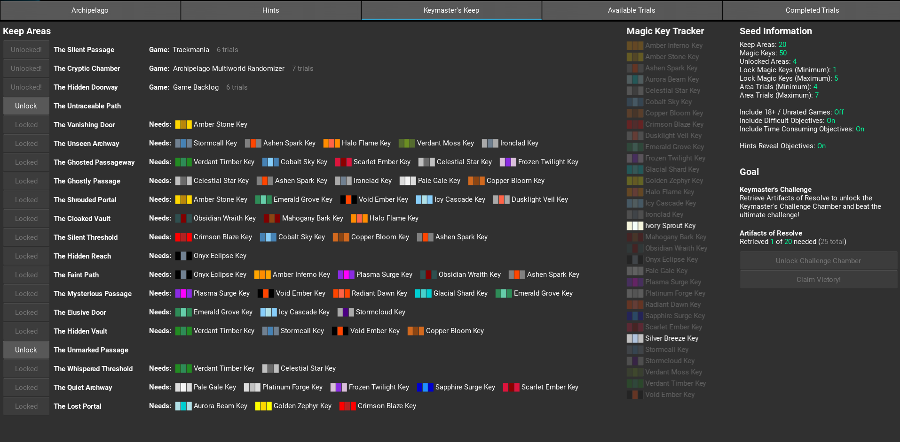
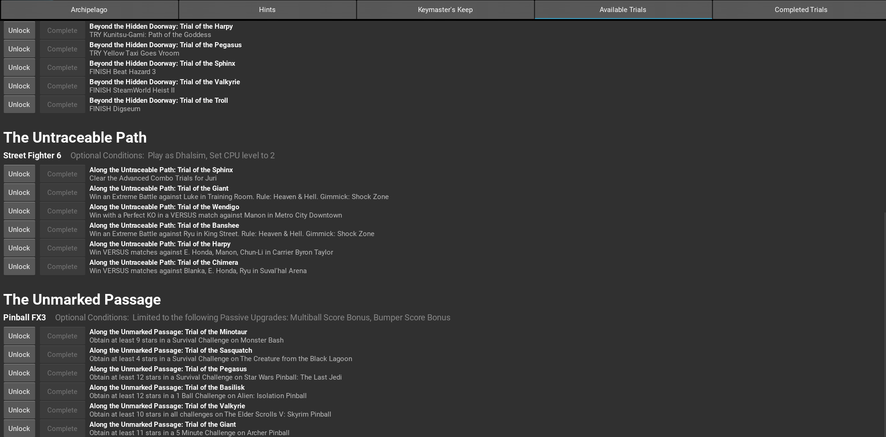

# What is Keymaster's Keep?

Keymaster's Keep is a dynamic, multi-game objective / challenge generator that seamlessly integrates with a thematic Archipelago randomizer. In other words, you have a typical Archipelago randomizer with goals, finite locations, progression items, logic etc. and Keymaster's Keep will generate and associate unique game challenges with each location. The APWorld will provide increasing monolithic support for games, as well as a dedicated client to assist with the exploration and challenges of Keymaster's Keep.

## When you play Keymaster's Keep...
You will generate a new keep with distinct areas
A few of these areas will be unlocked from the start
The rest will be locked and will require combinations of magic keys to unlock
These magic keys are scattered throughout the multiworld
Once an area is unlocked, a set of trials for a specific game will be revealed
For each trial you complete, you will manually check it off in the client and that will correspond to a location check
Your goal will either be to collect enough artifacts of resolve to unlock a final challenge to beat or to escape the keep with a certain number of magic keys in hand.

##

